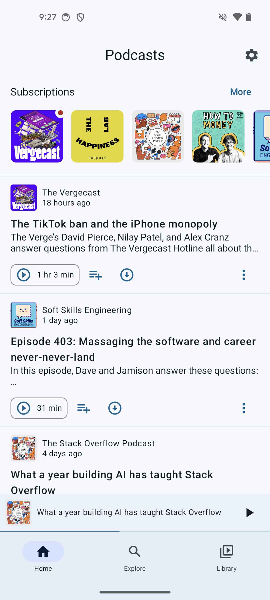
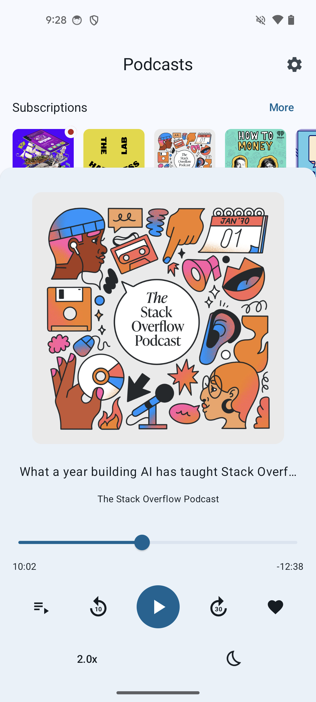

# Podcasts

Yet another podcast app. My wife and I both really enjoy using Google Podcasts because of its 
simplicity and basically complete feature set but sadly it is getting shut down on Apr 2, 2024. 
We tried several other apps but didn't find the same appeal in any of them which is why I decided 
to replicate the UI and functionality here.

## Features
- Offline first 
- Allows import from Google Podcasts
- Queue management
- Sleep timer
- Speed change 
- Trim silence 
- More to come...

## Built using 
- Kotlin multiplatform (Android only for now)
- Jetpack compose
- Media 3

## Screenshots

